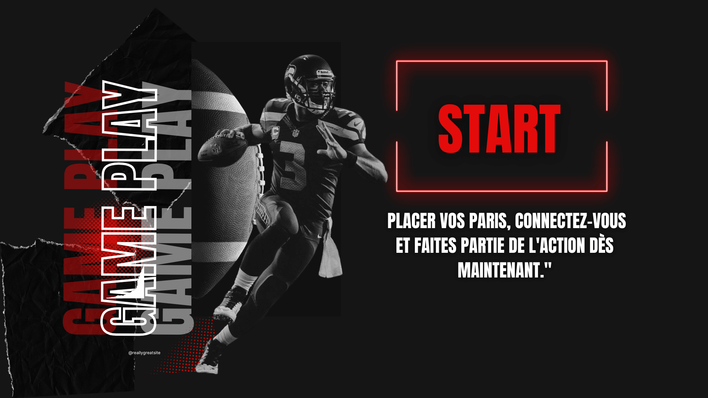
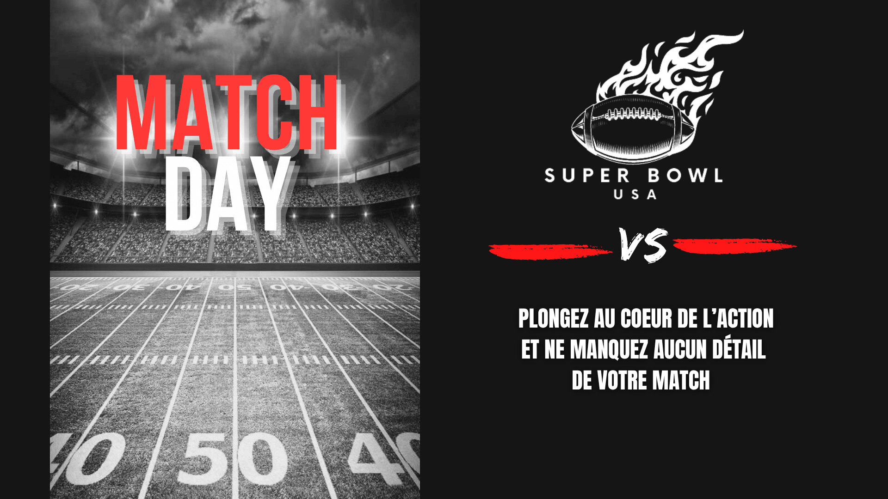
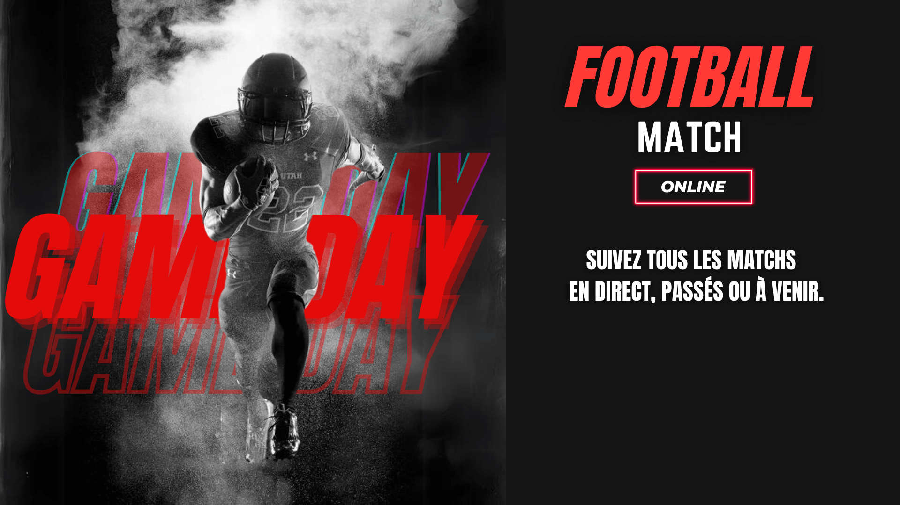
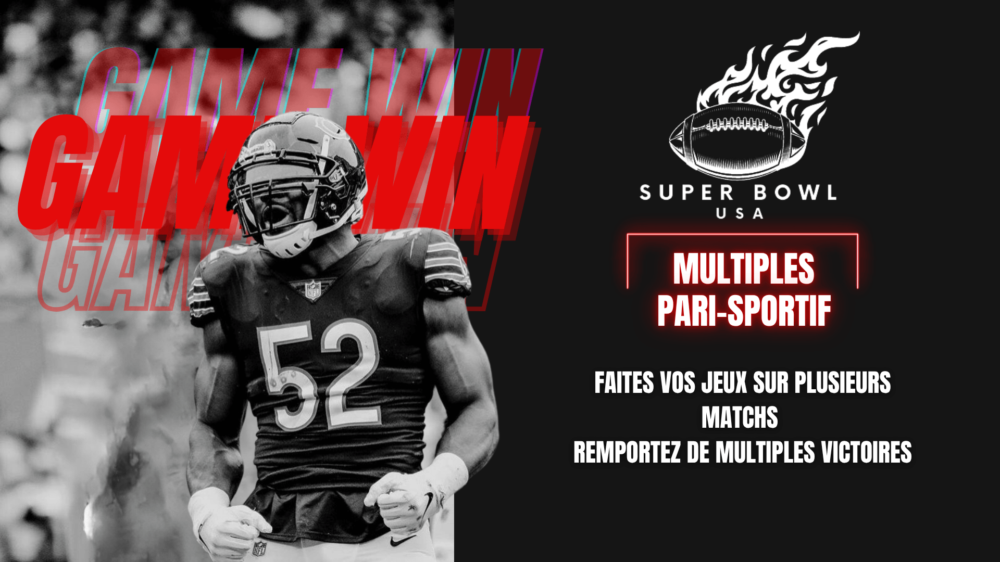

# Super Bowl Ecosystem

Multi-platform digital product ecosystem built across web, mobile and desktop environments.

Designed for sports event management and betting experiences with a strong focus on usability, accessibility and scalable product architecture.

  

---

## Product Overview

Super Bowl is a complete digital ecosystem composed of three interconnected applications:

- Web Platform
- Mobile Application
- Desktop Application (Electron)

The ecosystem allows users to follow matches, place bets and manage sports event operations across multiple platforms.

Administrators can manage:
- teams
- matches
- betting systems
- sports comments
- match schedules

  

  ---

## Applications

### Web Application

Main platform for users and administrators.

Features:
- Sports betting system
- Match management
- Authentication & roles
- Team management
- Sports comments

Repository:
👉 https://github.com/christinemiko/super_bowl

Live demo:
👉 https://super-bowl.christinechau.fr/

  

---

### Mobile Application

React Native mobile experience focused on match tracking and betting follow-up.

Features:
- User betting history
- Match details
- Mobile-first experience

Repository:
👉 https://github.com/christinemiko/super_bowl_mobile

---

### Desktop Application (Electron)

Desktop tool dedicated to sports commentators and match operations.

Features:
- Match closing
- Schedule management
- Internal operations

Repository:
👉 https://github.com/christinemiko/bureautique-superbowl

---

## Tech Stack

### Frontend
- HTML5
- CSS3
- Bootstrap 5
- JavaScript ES6
- Twig

### Backend
- PHP 8.1
- Symfony 6.3
- MariaDB

### Mobile
- React Native
- Expo

### Desktop
- Electron

---

## Product Architecture

The project was designed as a multi-platform ecosystem sharing:
- a centralized backend API
- consistent user experience
- scalable product structure
- cross-platform logic

  

---

## Documentation

### Technical Documentation
- UML diagrams
- Class diagrams
- Sequence diagrams
- Use cases
- Database schema

Available in:
`Schémas MCD, diagrammes`

### Design Documentation
- Wireframes
- Mockups
- UI explorations

Available in:
`maquettes Mockups et wireframes`

### User Manual
Available in:
`manuel d'utilisation Super Bowl.pdf`

---

## Project Management

Trello:
👉 https://trello.com/b/JHikLRMT/super-bowl-christine-chau

---

## Author

Christine Chau  
Product Engineer & Builder

🌐 https://christinechau.fr/  
🐙 https://github.com/christinemiko
