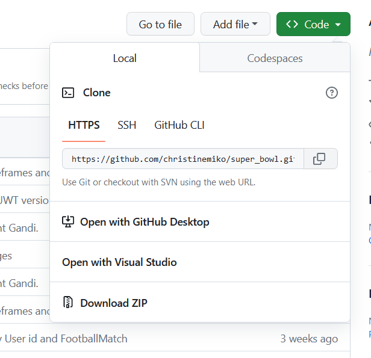
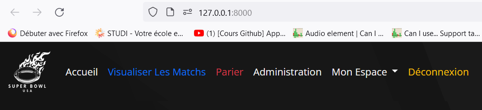
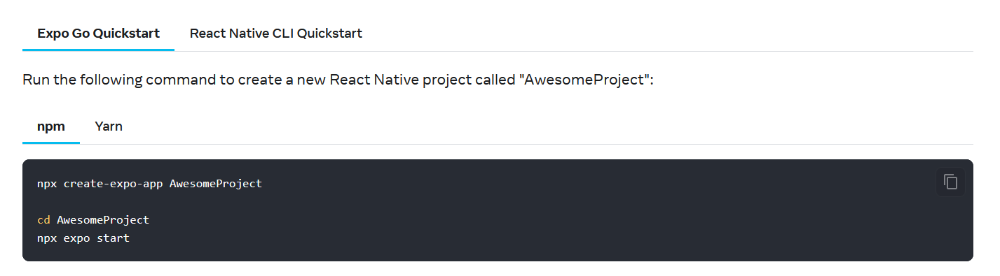
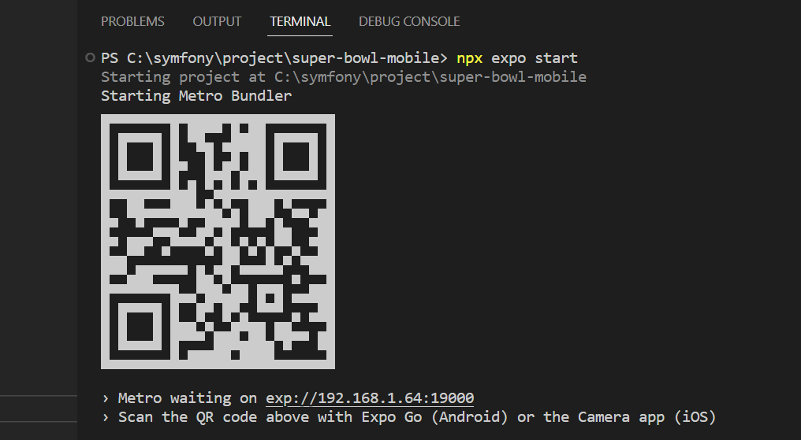
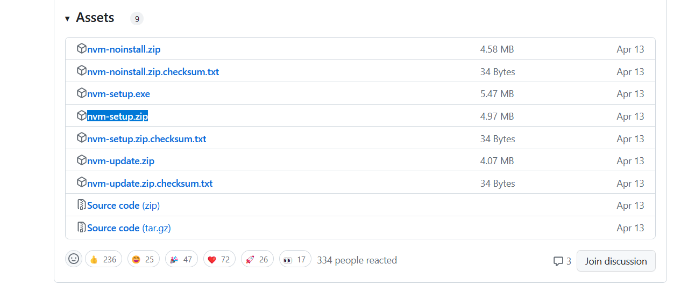
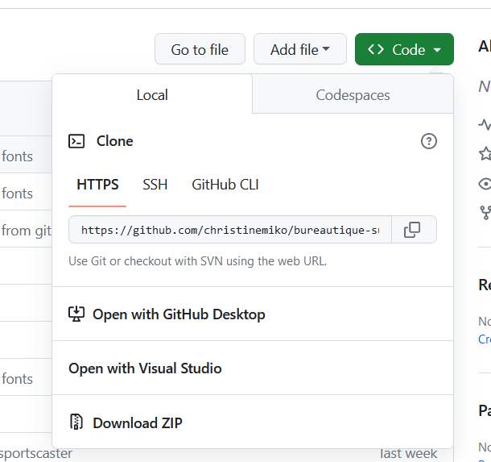

# SUPER BOWL

Création de trois Applications: Web, Mobile et Bureautique pour l'évènement du Super Bowl, mandaté par une start up Stania, passionnée de sports. 

Ces plateformes permettent aux visiteurs d'accéder à toutes les informations relatives aux matchs en cours, à venir ou terminés afin de favoriser les paris sportifs ainsi que la gestion des matchs pour les administrateurs.

Suivant la volonté du Super Bowl, la plateforme WEB permet aux utilisateurs de miser des montants sur des équipes concernant des matchs à venir, ils peuvent modifier ou supprimer leur paris. Les administrateurs peuvent créer
des matchs, des équipes, ajouter des commentaires sportifs et modifier les paris sportifs.
La plateforme Mobile permet de visualiser tous les Matchs ou l'utilisateur a déjà parié, avec les détails du match et du pari sportif.
La plateforme Bureautique n'est destiné qu'au commentateur sportif, il peut cloturer le match, modifier l'horaire de cloture.

L'Appli WEB a été réalisé avec les versions:
- HTML 5
- CSS 3
- BOOSTRAP 5.2
- PHP 8.1
- SQL 10.4.27-MariaDB
- SYMFONY 6.3
- TWIG
- JAVASCRIPT ESCMA SCRIPT 6

L'Appli Mobile a été réalisé avec les versions:
- REACT  "18.2.0"
- REACT NATIVE "0.71.8",
- BACK END : API REST SYMFONY 6.3

L'Appli BUREAUTIQUE a été réalisé avec les versions:
- ELECTRON electron@25.2.0
- BACK END : API REST SYMFONY 6.3

Serveur: gandi

Lien de l'application web en ligne:
https://super-bowl.christine-chau-projets.com/

Lien du dépôt github:

APPLI WEB
https://github.com/christinemiko/super_bowl

APPLI MOBILE
https://github.com/christinemiko/super_bowl_mobile

APPLI BUREAUTQUE
https://github.com/christinemiko/bureautique-superbowl

Lien TRELLO ,logiciel pour la gestion de ce Projet:
https://trello.com/b/JHikLRMT/super-bowl-christine-chau

Les fichiers de création de la base de données sont dans:
super_bowl\migrations

Les fichiers d'alimentation de la base de données sont dans:
super_bowl\src\DataFixtures

La documentation technique ( Diagramme de Classe, Diagramme de séquence, Diagramme de cas d'utilisation, charte graphique) 
se trouve dans le dossier: "Schémas MCD, diagrammes" sur github

La documentation maquettes ( Mockup Desktop et Mockup Mobile) 
se trouve dans le dossier: "maquettes Mockups et wireframes" sur github.

Le manuel d'utilisation se trouve dans github: super_bowl/manuel d'utilisation Super Bowl.pdf


## Auteur
   Christine Chau
- [@christinemiko](https://github.com/christinemiko)


## Déploiement en Local pour l'appli WEB

Pré-requis:  L'installation des logiciels suivants est nécessaire pour le déploiement en local, avant de commencer toutes les étapes.
- Xampp (inclus Apache et MySQL)
- Github
- phpMyAdmin
- PHP 8.1
- Symfony 6.3
- Php Storm


1. Etape 
- Aller sur le lien Github du projet https://github.com/christinemiko/super_bowl
- Cliquez sur le bouton vert " <> Code "
- Copiez le lien HTTPS du projet https://github.com/christinemiko/super_bowl


2. Etape 
 - Aller dans Windows(C:) > symfony 
 - Clic Droit sur la souris à cet emplacement (dans le vide) > afficher plus d'options > Cliquez sur Gitbash Here
 - Un terminal s'affiche, taper le ligne de commande ci-dessous, pour cloner le projet en local, dans l'espace.
```bash
  git clone https://github.com/christinemiko/super_bowl

```
 Le projet est enregistré en Local. Un Dossier Super Bowl est  nouvellement présent et visible  
 dans Windows(C:) > symfony > super_bowl .

3. Etape
- Lancer XAMPP sur Apache ( clic start) et sur MYSQL ( clic start).  " Apache" et "Msql" deviennent vert lorsquils sont connectés en Localhost.
- Ouvrir ce dossier super_bowl dans PhpStorm.
- Aller dans votre terminal sous phpStorm 
- dans le terminal de PhpStorm entrez le code:
```bash 
 Symfony serve

```
- lorsque symfony est bien connecté,
le message suivant s'affiche dans le terminal :
```bash 
 [OK] Web serverlistening                                                                                              
      The Web server is using PHP CGI 8.1.12                                                                            
      http://127.0.0.1:8000                   

```
4. Etape
- Cliquez sur   http://127.0.0.1:8000  dans le terminal de PhpStorm.


- La page d'accueil du SUPER BOWL est affichée en localHost 127.0.0.1.8000 
 Pour les Admins et les clients , le portail de connexion est le même. Il suffit de rentrer ses identifiants pour avoir accès, en fonction du rôle de l'utilisateur aux différentes interfaces du site.



## Déploiement en Local pour l'appli MOBILE

Pré-requis:  L'installation des logiciels suivants est nécessaire pour le déploiement en local, avant de commencer toutes les étapes.
- Pour installer ces versions de React native, ref https://reactnative.dev/docs/environment-setup

- REACT  "18.2.0"
- REACT NATIVE "0.71.8",
- VISUAL STUDIO CODE

1.Veuillez dans le terminal de VSCODE, entrez ceci 
```bash 
npx create-expo-app SuperBowlMobile

```
2.Effectuer un Git Clone dans ce dossier "SuperBowlMobile" avec https://github.com/christinemiko/super_bowl_mobile.git

3.Lorsque EXPO go/ React Native est installé, installer toutes les autres dépendances au projet Mobile.
Dans le terminal de VSCODE, veuillez exécuter ces commandes.
```bash 
 npm install react-native-sensitive-info

```
4.Permet de stocker le token d'authentification dans sensitive/infos.
```bash 
 npx expo install@react-native-async-storage/async-storage@1.17.11

```
5.Installation de AsyncStorage avec la dernière version de Expo Go
```bash 
 npm install@react-navigation/stack

```
6.permet de mettre en place le StackNavigator pour la navigation.

Lorsque toutes les dépendances sont installés sur l'ordinateur, dans Visual Studio Code , dans le terminal
lancer la commande suivante pour lancer Expo Go, cela va générer un QR code.
```bash 
 npx expo start

```

7. télécharger dans lapps store de votre mobile, "expo go" https://play.google.com/store/apps/details?id=host.exp.exponent&hl=en_US&pli=1

8. Ouvrir Expo go sur votre mobile et cliquez sur SCAN QR CODE et scanner le QR CODE du terminal de VSCODE.

9. L'appli mobile Super Bowl s'affiche sur votre mobile.

## Déploiement en Local pour l'appli BUREAUTIQUE
Pré-requis:  L'installation des logiciels suivants est nécessaire pour le déploiement en local, avant de commencer toutes les étapes.
- ELECTRON electron@25.2.0
- VISUAL STUDIO CODE

1. pour installer Electron, allez sur cet URL https://github.com/coreybutler/nvm-windows/releases
2. Ce dépôt Github permet de télécharger la version de Node.js qui s'adapte en fonction des versions par rapport à la documentation officielle d'électron ( obselète après test).
Descendre en bas du site, dans la Partie ASSET et télécharger " nvm-setup.zip" et l'installer.

3. Dans le terminal Vscode ou PC (cmd), taper "nvm" pour vérifier que l'installation est présente. 
```bash 
 nvm

```
4. Dans le terminal Vscode ou PC (cmd), taper "nvm list available" pour afficher un tableau avec les dernières versions de LTS.
```bash 
 nvm list available

```
5. Sélectionnez la dernière version LTS 18.16.1 affiché dans ce tableau en tapant la commande suivante dans le terminal de VSCODE ou PC (cmd).
```bash 
 nvm install 18.16.1

```
6. Vérifier que Node.js et NPM soient bien installés, dans votre terminal VSCODE ou PC (cmd).
```bash 
node -v

```
```bash 
npm -v

```
cette commande permet de créer le fichier package.json (-y) génère le fichier par défaut.
```bash 
npm init -y

```

7. Ouvrir le dossier SuperBowlBureautique dans VSCODE et dans le terminal de VSCODE, lancer la commande: "npm start"
```bash 
npm start

```
8. Lancer l'installation de Electron via le terminal de VSCODE. Après cette commande, Electron est installé.
```bash 
npm install --save-dev electron

```
9. ouvrir VSCODE , créer un dossier SuperBowlBureautique
10. Dans le dossier SuperBowlBureautique, "Git clone" le project existant  via  lurl https://github.com/christinemiko/bureautique-superbowl.git, dans le terminal.
   
```bash 
git clone https://github.com/christinemiko/bureautique-superbowl.git

```
11. Ouvrir VSCODE File> Open Folder > SuperBowlBureautique Vous avez accès à l'appli Bureautique en LocalHost avec Electron.
12. Attention, il est nécessaire à chaque fois de lancer dans le terminal VSCODE ' npm start' pour lancer electron, et l'affichage 
du projet apparaît après 2 minutes !!!
```bash 
npm start

```